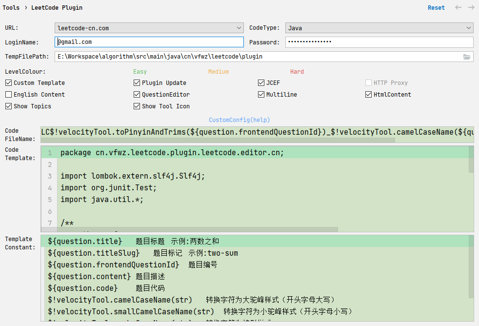

### 个人LeetCode刷题仓库

---

#### 工欲善其事，必先利其器

##### 1. 刷题插件

Leetcode Editor

[Git仓库](https://github.com/shuzijun/leetcode-editor)

> 插件配置



- Code FileName
`LC$!velocityTool.toPinyinAndTrims(${question.frontendQuestionId})_$!velocityTool.camelCaseName(${question.titleSlug})`


- Code Template
```java
package cn.vfwz.leetcode.plugin.leetcode.editor.cn;

import lombok.extern.slf4j.Slf4j;
import org.junit.Test;
import java.util.*;

/**
 * author: vfwz
 * date: $!velocityTool.date()
 * title: [${question.frontendQuestionId}]${question.title}
 */
@Slf4j
public class LC$!velocityTool.toPinyinAndTrims(${question.frontendQuestionId})_$!velocityTool.camelCaseName(${question.titleSlug}) {

    @Test
    public void testSolution() {
        Solution solution = new Solution();
    }
    
    ${question.code}
}
    

```

##### 2. 问题调试

- 添加如下pom
> 引入junit，省去main方案，使用@Test注解直接运行程序
> 
> 引入lombok, slf4j，使用@Slf4j注解可以标准化日志输出

```xml
    <dependencies>
        <dependency>
            <groupId>junit</groupId>
            <artifactId>junit</artifactId>
            <version>4.12</version>
        </dependency>

        <dependency>
            <groupId>org.projectlombok</groupId>
            <artifactId>lombok</artifactId>
            <version>1.18.0</version>
        </dependency>

        <dependency>
            <groupId>org.slf4j</groupId>
            <artifactId>slf4j-api</artifactId>
            <version>1.7.36</version>
        </dependency>

        <dependency>
            <groupId>org.slf4j</groupId>
            <artifactId>slf4j-simple</artifactId>
            <version>1.7.36</version>
        </dependency>
```

- slf4j-simple输出定制
> 在classpath下增加simplelogger.properties文件，内容如下
```properties
# slf4j-simple配置文件
org.slf4j.simpleLogger.showLogName=false
org.slf4j.simpleLogger.showThreadName=false
org.slf4j.simpleLogger.logFile=System.out
org.slf4j.simpleLogger.levelInBrackets=true
org.slf4j.simpleLogger.warnLevelString=LC
```


